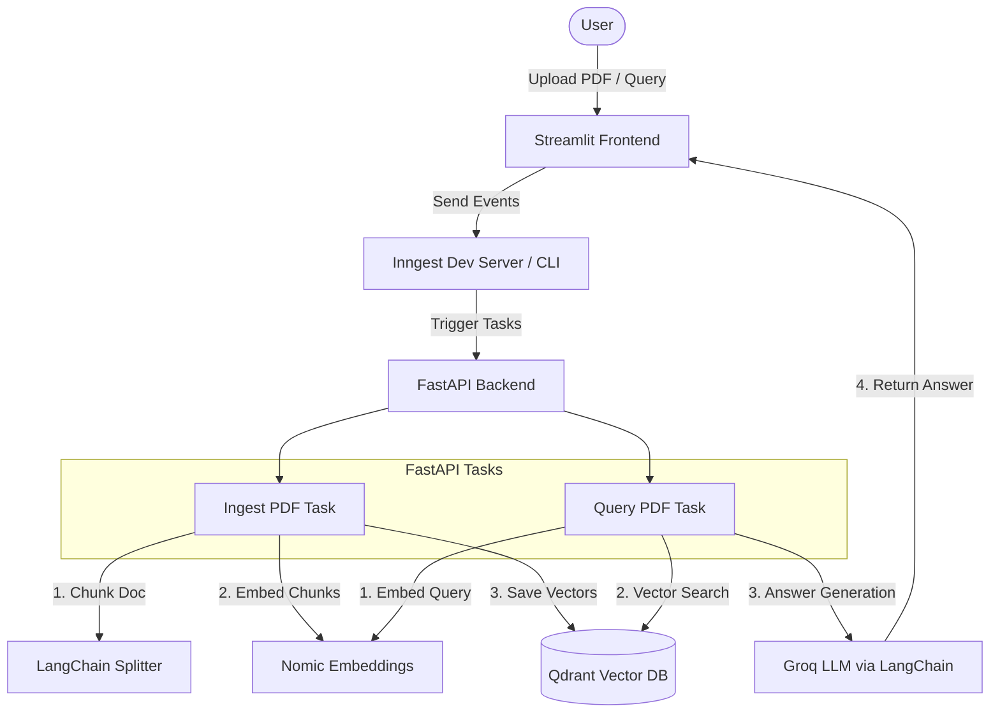

# Production-Ready RAG Application

An event-driven Retrieval-Augmented Generation (RAG) system built with **FastAPI**, **Inngest**, **Streamlit**, **LangChain**, and **Qdrant**.

This application leverages Inngest's event-driven orchestration to handle long-running document ingestion pipelines (chunking, embedding, storing) and conversational querying workflows reliably with built-in rate-limiting and throttling.

---

## 🏗️ Architecture



---

## 🛠️ Prerequisites

Ensure you have the following installed on your machine:
- **Python >= 3.13** (Managed with `uv` for speed and consistency)
- **Docker Desktop** (To run Qdrant Vector Database)
- **Node.js & npm** (To run the Inngest CLI/Developer Dashboard)
- A **Groq API Key** (Get yours from the [Groq Console](https://console.groq.com/))

---

## ⚙️ Setup and Installation

### 1. Clone & Navigate to Project Directory
Make sure you are in the project root:
```bash
cd production_rag
```

### 2. Configure Environment Variables
Create a `.env` file in the root directory and add your Groq API Key:
```env
GROQ_API_KEY=your-groq-api-key-here
```

### 3. Install Dependencies
This project uses `uv` for package management. Install the virtual environment and all requirements by running:
```bash
uv sync
```

---

## 🚀 Running the Application

To run the entire system, you need to start **four services** (each in a separate terminal window):

### Step 1: Start Qdrant Vector DB
Run a local instance of the Qdrant Vector Database via Docker:
```bash
docker run -p 6333:6333 -p 6334:6334 -v qdrant_storage:/qdrant/storage qdrant/qdrant
```

### Step 2: Start the FastAPI Backend
Start the FastAPI server which processes Inngest background tasks:
```bash
.venv\Scripts\python -m uvicorn main:app --reload --port 8000
```
*Note: The Inngest communication route is served at `http://localhost:8000/api/inngest`.*

### Step 3: Start the Inngest Dev Server
Launch the Inngest CLI/Dev Server to route events between your frontend and backend:
```bash
npx inngest-cli@latest dev -u http://127.0.0.1:8000/api/inngest --no-discovery
```
*Access the Inngest Developer Dashboard at [http://localhost:8288](http://localhost:8288).*

### Step 4: Start the Streamlit Frontend
Start the user interface for document upload and querying:
```bash
.venv\Scripts\python -m streamlit run streamlit_app.py
```
*The browser will automatically open [http://localhost:8501](http://localhost:8501).*

---

## 📖 How to Use the App

1. **Ingest a Document**:
   - Open the Streamlit App (`http://localhost:8501`).
   - Upload any PDF document under the **"Upload a PDF to Ingest"** section.
   - Click upload. The frontend sends a `rag/ingest_pdf` event to Inngest, which handles chunking and embedding generation asynchronously.

2. **Query the System**:
   - Once a document is ingested, scroll down to **"Ask a question about your PDFs"**.
   - Type your question in the text box.
   - Adjust the **"How many chunks to retrieve"** parameter (defaults to 5).
   - Click **Ask**. The application queries Qdrant for relevant context chunks, passes them along with your question to the Groq LLM, and prints the generated response along with the document sources retrieved.

3. **Monitor Execution (Inngest Dashboard)**:
   - Open [http://localhost:8288](http://localhost:8288).
   - Inspect individual event triggers, trace execution latency, monitor step functions, and inspect rate-limiting and throttling rules.

---

## 📦 Key Technologies

- **[Inngest](https://www.inngest.com/)**: Event-driven orchestration with built-in concurrency controls, retries, and rate limits.
- **[Qdrant](https://qdrant.tech/)**: High-performance vector database.
- **[LangChain](https://www.langchain.com/)**: Modular prompt engineering and LLM integrations.
- **[Groq Cloud](https://groq.com/)**: Fast inference engine for model execution.
- **[Streamlit](https://streamlit.io/)**: Rapid web application prototyping framework.
- **[FastAPI](https://fastapi.tiangolo.com/)**: Fast, modern, and high-performance Web API framework.
